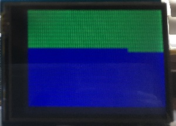

# YourLifeinWeeksArduinoCalendar
Weeks in Lifetime Arduino Calendar 

### Motivation
Inspired by <a href="http://waitbutwhy.com/2014/05/life-weeks.html">Your Life in Weeks</a>, this is an Arduino calendar displaying the number of weeks used and remaining in a 75 year lifespan. It was designing as a tool to help motivate me to make the most of my days, considering the number of weeks left. 

The photo above demonstrates what this calendar looks like at age 30 out of 75. Motivating or depressing?

### Parts Used
* Arduino R3 Uno
* <a href="https://www.adafruit.com/products/1651">2.8" TFT Touch Shield for Arduino with Resistive Touch Screen</a>

### Setup
Installation was simple as the display came with a shield compatible with the R3, so no soldering was required. Adafruit provided some great tutorials on getting the right libraries.

### Next Steps
I wouild like to attach a clock, so I can calculate the number of weeks remaining in my life calendar at real-time. In addition, making this battery operated and encased so it can be mounted on a wall would be ideal. 